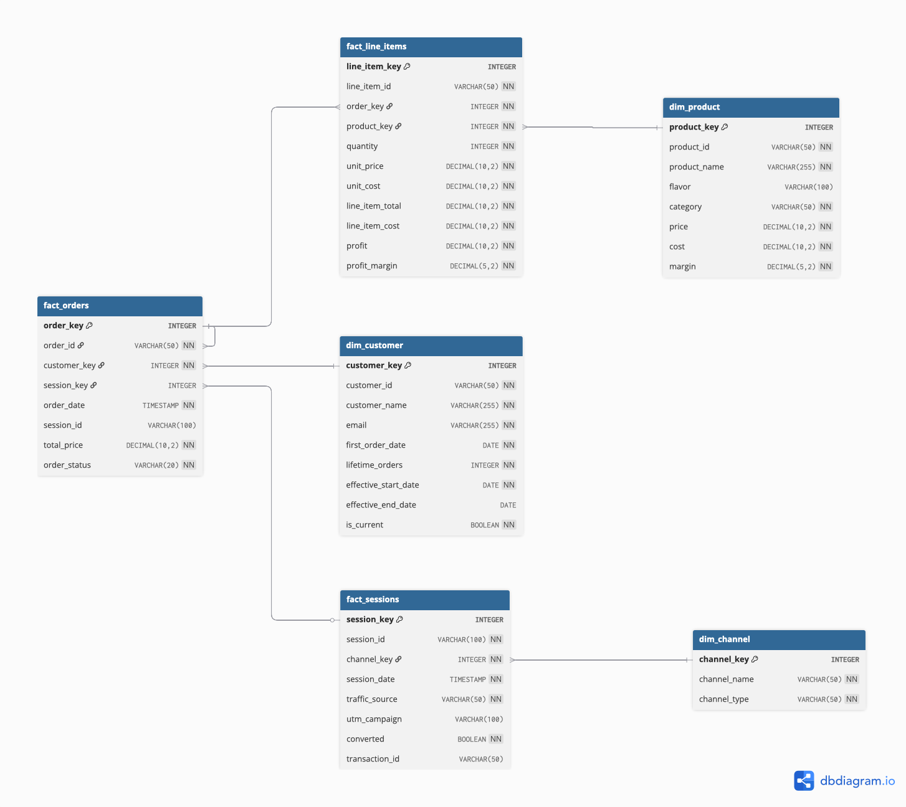

# RAW Nutrition - Shopify Overview Dashboard

This dashboard helps understand overall business health through year-over-year performance tracking of key metrics: profit, revenue, orders fulfilled, and returning customer rate across a 109-SKU sports nutrition product line.

**Tools Used:** SQL, Python, Tableau

**Data Sources:** Data model based on Shopify, Google Analytics 4, Facebook Ads, Instagram Analytics, TikTok Analytics schemas. All data is fictional.

[Tableau Dashboard Link](https://public.tableau.com/app/profile/valerie.madojemu/viz/ShopifyOverviewRAWNutritionConcept/ShopifyOverview)

## Dashboard Preview

## 1. Business Context

**The Situation**

RAW Nutrition operates a sports nutrition business through D2C and B2B channels (Crunch Fitness, GNC, Sam's Club, The Vitamin Shoppe). Despite spending $1M+ monthly on paid media with Black Friday campaigns reaching $2-3M, the team had zero visibility into their own metrics. Key questions remained unanswered: What are sustainable customer acquisition costs? What is the lifetime value of customers acquired through paid ads? How much revenue is bleeding into other channels?

These questions, raised in the CEO's vlog, inspired further analytical questions: Which product categories drive profitability? How do social media channels compare in conversion effectiveness? What retention patterns indicate customer satisfaction?

**Inspiration:** [Dom Iacovone - CEO Vlog](https://www.youtube.com/watch?v=uAIroCpqaiU)

**Project Structure**

This project is split into three parts:
1. **Part 1 (Current):** Shopify visibility - understanding overall business health
2. **Part 2 (Future):** Cost per acquisition sustainability and ROAS tracking
3. **Part 3 (Future):** Customer analytics and segmentation

**Current Focus - Shopify Overview**

To tackle the zero visibility issue, I first examined "How is the overall business performing?" through year-over-year comparisons across 2024 and 2025 covering 1.4 million rows of transactional data.

## 2. Dataset and Metrics

**Data Model:**

The data model is based on schemas from Shopify, Google Analytics 4, Facebook Ads, Instagram Analytics, and TikTok Analytics. This synthetic data is structured in a star schema with three fact tables (Orders, Line Items, Sessions) and three dimensions (Product, Customer, Channel), enabling analysis across 178,900 orders, 393,700 line items, and 715,700 marketing sessions.

**Data Model Capabilities:**
- Track profit and revenue at order and product level
- Connect social media sessions (Instagram, TikTok, Facebook) to conversions
- Analyse customer repurchase behaviour across 109 SKUs
- Compare year-over-year performance (YTD 2025 vs 2024)

All data is synthetic, generated using Python to demonstrate realistic e-commerce patterns including seasonality (Black Friday 4x baseline, January +40%, Summer -15%) and margin variance across product portfolio.

## 3. Insights and Impact

**Key Findings:**
- **Strong growth:** Profit +34%, Revenue +41%, Orders +51% YTD 2025 vs 2024
- **Channel performance:** Instagram leads with 22% conversion rate from 400K+ sessions
- **Product concentration:** Protein category drives £2.15M profit; top two flavours (Red Velvet £1.36M, Milk & Cookies £1.16M) account for significant revenue
- **Retention dip:** Returning customer rate declined 4% to 66%

**Business Value:**

Provides visibility for Black Friday allocation decisions (prioritise Instagram channels), inventory optimisation (focus top Protein flavours), and customer acquisition efficiency insights (order volume growing 51% versus revenue 41% indicates declining acquisition costs per customer, signalling sustainable marketing spend).

## 4. Next Steps

**Immediate Actions:**
- Scale Instagram ad investment by 25-30% given 22% conversion rate and 75% traffic share
- Conduct deep dive retention analysis: build cohort curves to identify exact drop off point in customer journey
- Audit post-purchase email sequences and reengagement timing to address 4% retention decline

**Short-term Initiatives:**
- Launch sample pack bundles featuring top Protein flavours (Red Velvet, Milk & Cookies) to convert variety-seeking behaviour into repeat purchases
- Evaluate Recovery category products for potential discontinuation or repositioning based on profitability thresholds
- Implement A/B testing framework for Instagram creative formats to optimise conversion efficiency further
- Develop automated forecasting system with alerting for KPI anomalies (>10% deviation) to help inventory managers ensure adequate stock levels meet demand and prevent stockouts during peak periods

**Future Expansion:**

**Part 2 Dashboard - Channel Investment & Performance:**
- Build CAC and ROAS tracking against $2-3M Black Friday budget
- Implement channel-level attribution across Instagram, Facebook, and TikTok
- Track real-time spend pacing, conversion rates, and return on ad spend
- Optimise budget allocation during peak campaigns

**Part 3 Dashboard - Customer Analytics:**
- Complete customer segmentation with demographic overlays and lifetime value predictions
- Build cohort retention curves showing customer value progression over 90/180/365 day windows to identify high-value customer segments
- Extend product analysis with flavour preference clustering and purchase sequence patterns to inform product development strategy

## 5. Reflection

**Potential Improvements:**

While the current dashboard provides foundational business health visibility, there are additional KPIs that could deepen operational insights. These enhancements would provide a more comprehensive view of transaction behaviour, operational efficiency, and technical reliability. But to prevent including too much information I left it out.

**Transaction Metrics:**
- Average Order Value (AOV) to track pricing effectiveness
- Average Items per Order for basket size analysis
- Discount Usage Rate to measure promotional impact

**Operational Health Indicators:**
- Product Return/Refund Rate to signal quality and satisfaction
- Inventory Turnover to measure stock efficiency
- Shipping Time to track fulfillment speed

**Technical Enhancements:**
- Implement database connections rather than CSV files
- Enhance data validation workflows to catch inconsistencies earlier in the ETL pipeline
- Build Pipeline using DBT

## 6. Links

- [Tableau Dashboard](https://public.tableau.com/app/profile/valerie.madojemu/viz/ShopifyOverviewRAWNutritionConcept/ShopifyOverview)
- [Dom Iacovone - CEO Vlog](https://www.youtube.com/watch?v=uAIroCpqaiU)
